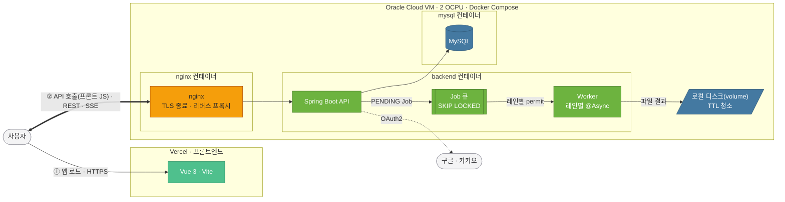

<div align="center">


# OnTool · 온툴

### 모든 도구, 한 곳에.

개발자 도구 · 파일·문서 · 생활 도구 · 재미·게임<br/>
**4개 구역 · 100개 도구**를 담은 종합 도구 포털

[](https://github.com/piker0925/ontool/actions/workflows/deploy.yml)
[](LICENSE)

[](https://dev-toolbox-ivory.vercel.app)


</div>

> 백엔드 데브코스 10기 12회차 — 데브코스 프로덕트 챌린지 프로젝트

백엔드는 공통 인터페이스(`ToolModule`) 하나로 파일 처리형 도구를 관리한다 — 새 도구는 `@Component` 클래스 하나만 추가하면 자동 등록된다. PDF 변환처럼 수 초 걸리는 파일 처리부터 JSON 포맷터처럼 브라우저에서 즉석에 끝나는 계산까지, 처리 위치가 전혀 다른 도구들이 같은 카탈로그·검색·통계 위에서 공존한다.

### 한눈에

| | 구역 | 대표 도구 | 도구 수 |
|:--:|---|---|:--:|
| 🟦 | **`/dev` 개발자 도구** | 포맷터 · 인코더 · 데이터 변환 · 코드 생성 · 보안 · 네트워크 | 33 |
| 🟩 | **`/files` 파일·문서** | PDF · 이미지 · 영상 · 오디오 · 오피스 문서 변환 | 33 |
| 🟧 | **`/life` 생활 도구** | 급여 · 금융 · 건강 · 날짜 · 단위 계산기 | 20 |
| 🟪 | **`/fun` 재미·게임** | 로또 · 랜덤 도구 · 워드클라우드 · 미니게임 8종 | 14 |

랜딩 대문(`/`)에서 구역을 고르거나 ⌘K로 검색 · **소셜 로그인**(구글·카카오, JWT) · 개인화 동기화 · 댓글 · 사용 통계 · 관리자 페이지. 순수 계산 도구는 브라우저에서 직접, 파일 처리는 **MySQL만으로 만든 비동기 큐**로. (전체 목록은 [제공 도구](#제공-도구) 참조.)

---

## 핵심 엔지니어링

이 프로젝트에서 특히 공들인 세 가지.

1. **외부 인프라 없이 MySQL만으로 만든 비동기 작업 큐** — Redis·RabbitMQ 없이 `Job` 테이블 + `SELECT ... FOR UPDATE SKIP LOCKED`로 다중 워커가 동시에 꺼내가도 중복 처리 없는 큐를 구현하고, **레인(Lane) 기반 동시성 제어**(영상 인코딩=동시 1, 짧은 작업=동시 2)와 소유자별 공정 스케줄링·용량 인지 admission으로 2코어 무료 VM에서도 무거운 작업이 큐를 막지 않게 했다. ([설계 →](docs/adr/0019-job-scheduler-resource-model.md))
2. **익명 우선 + 소셜 로그인 인증** — OAuth2(구글·카카오) + JWT access/refresh **회전·멀티탭 유예·탈취 감지**, 로그아웃 access 블랙리스트로 stateless JWT의 즉시 무효화까지. 크로스도메인 제약을 쿠키 대신 localStorage + 짧은 수명으로 푼 트레이드오프. ([설계 →](docs/adr/0024-user-auth-social-jwt.md))
3. **공통 카탈로그로 백엔드 33개·프론트 67개, 100개 도구를 통합한 확장 구조** — 백엔드 도구는 `ToolModule`을 구현하는 `@Component` 클래스 하나만 추가하면 자동 등록되고, 순수 계산으로 끝나는 나머지 67개는 백엔드를 거치지 않고 프론트에서 바로 처리된다. 성격이 다른 파일 처리·즉석 계산·게임·문서 뷰어가 같은 카탈로그·검색·통계 위에 공존하되, 행위 공유는 일부러 하지 않아(과추상화 방지) 데이터 계층만 통합했다. ([설계 →](docs/adr/0026-page-module-generalization.md))
4. **SSRF 방어 — DNS 리바인딩 TOCTOU까지 차단** — HTML 가져오기 도구는 호스트명을 문자열이 아니라 실제 DNS 해석 결과(IP)로 사설·루프백·CGNAT 대역 여부를 검사하고, JDK `InetAddressResolverProvider` SPI(JEP 418)로 검증에 쓴 주소를 스레드에 고정해 검증 직후 재조회 사이의 DNS 리바인딩 TOCTOU까지 막는다. (자세히 → 아래 [보안 · 프라이버시](#보안--프라이버시))

> **테스트**: 백엔드 600+ (JUnit 5 · Testcontainers MySQL · Awaitility) · 프론트엔드 1,130+ (vitest). 주요 결정은 [ADR 31건](docs/adr/)으로 기록.

## 아키텍처



Light 도구(계산기·인코더·포맷터 등)는 백엔드를 거치지 않고 프론트엔드에서 직접 처리한다 — 위 흐름은 Heavy(파일 처리) 경로다.

---

## 동작 방식

도구는 두 종류로 나뉜다.

- **Heavy** — 이미지→PDF, PDF 병합, 영상 변환, 오피스 문서→PDF 같은 파일 처리형 도구. 파일을 업로드하면 처리가 끝날 때까지 시간이 걸리므로, 요청은 즉시 작업 ID만 돌려받고 완료되면 알림(SSE)으로 통보받아 결과를 다운로드한다.
- **Light** — JSON 포맷터, 계산기, 인코딩처럼 입력하면 그 자리에서 바로 결과가 나오는 도구. 대부분 브라우저에서 직접 계산해 서버로 데이터가 전송되지 않는다.

이 중 백엔드가 처리하는 도구(Heavy 전부 + Light 일부)는 `ToolModule` 인터페이스 하나로 관리된다.

```java
public interface ToolModule {
    String getId();
    String getName();
    String getCategory();
    boolean isHeavy();      // 처리 경로를 결정하는 유일한 분기점
    ToolResult process(ToolInput input) throws ToolProcessingException;
}
```

새 백엔드 도구는 이 인터페이스를 구현하는 `@Component` 클래스 하나만 추가하면 된다. Spring이 자동으로 감지해 등록하고, `isHeavy()` 값에 따라 처리 경로가 결정된다.

```
isHeavy() = true  → Job DB 등록 → 작업 ID 즉시 반환
                    ↓ 워커 백그라운드 처리
                    클라이언트: SSE로 완료 감지 → 결과 다운로드

isHeavy() = false → 즉시 처리 → 바로 응답
```

순수 계산으로 끝나는 Light 도구(계산기·인코더·포맷터 등)는 백엔드를 거치지 않고 **프론트엔드에서 직접 처리**한다(개인정보가 서버로 안 나가고, 서버 부하도 없음). 서버가 실제로 필요한 것(파일 처리, 외부 라이브러리 의존, 대용량 데이터)만 백엔드 모듈로 둔다.

---

## 제공 도구

**4개 구역 · 19개 카테고리 · 100개 도구.**

### `/dev` 개발자 도구
- **생성기** (7) — JSON Schema → DTO · OpenAPI → 코드 · UUID · JSON → TS 인터페이스 · 한국어 더미 데이터 · CSS 도구(gradient/box-shadow/타이포 스케일) · 코드 생성기(QR·바코드)
- **보안·암호화** (7) — RSA/EC 키쌍 · Bcrypt 해시 · 의존성 취약점 스캔(CVE) · 다중 해시 · HMAC 서명 · AES 암·복호화 · TOTP 생성
- **포맷터** (9) — SQL · XML · SVG 최적화 · JWT 디코더 · 타임스탬프 · 색상 코드 · JSON 도구 · 인코더/디코더 · 데이터 포맷 변환(JSON↔YAML/TOML/XML/CSV)
- **텍스트** (3) — Regex 테스터 · 마크다운 도구(TOC·표) · 텍스트 유틸(케이스·글자수·라인)
- **네트워크** (3) — URL 파서 · 서브넷 계산기 · HTML 소스 가져오기
- **DevOps** (4) — Cron 표현식 · docker run → Compose · curl → 코드 · .gitignore 생성기

### `/files` 파일·문서 (대부분 Heavy)
- **PDF** (8) — 이미지 → PDF · PDF 병합 · PDF 분할 · Markdown → PDF · 워터마크 · 비밀번호 설정/해제 · 헤더/푸터/페이지번호 · 문서(청구서) 생성기
- **이미지** (11) — 리사이즈 · 포맷 변환 · GIF 생성 · EXIF 제거 · EXIF 뷰어 · 콜라주 · 소셜 이미지 크롭 · 이미지 Diff · 색약 시뮬레이터 · Favicon 생성기 · 아스키 아트
- **영상** (7) — 트리밍/변환 · GIF 변환 · 프레임 추출 · 메타데이터 · 오디오 추출 · 병합 · 워터마크 (ffmpeg)
- **오디오** (5) — 피치 · 배속 · 자르기 · 포맷 변환 · 음량 (브라우저 Web Audio)
- **문서** (2) — 문서 뷰어(DOCX·XLSX 브라우저 렌더) · 오피스 문서 변환기(HWP·HWPX·PPTX·레거시 DOC/XLS/PPT → PDF, LibreOffice headless를 직접 구동 — 종료 코드 0인데도 변환이 실패하는 경우가 있어 출력 파일 존재 여부로 성공을 판정하고, 동시 요청마다 프로필을 격리해 락 충돌을 막는다)

### `/life` 생활 도구 (전부 프론트 로컬)
- **급여·근로** (4) — 연봉 실수령액 · 시급/월급/연봉 변환 · 퇴직금 · 초과근무수당
- **금융** (4) — 대출 원리금 · 예금/적금 · 전월세 전환 · 부가세
- **건강** (2) — BMI · 기초대사량
- **단위·변환** (3) — 단위 변환 · 택배 부피무게 · 타임존 변환
- **날짜·나이** (5) — 반려동물 나이 · D-Day/날짜 차이 · 만 나이 · 육아 개월수 · 출산예정일
- **텍스트** (1) — Diff 비교
- **생산성** (1) — 뽀모도로 타이머

> 급여·금융 계산기는 근사식이 아니라 **공식 자료 기반**이다(국세청 간이세액표·당년 4대보험 요율 등). 출처는 [`docs/data/rate-sources-2026.md`](docs/data/rate-sources-2026.md)에 기록.

### `/fun` 재미·게임 (전부 프론트 로컬)
- **재미** (6) — 로또 번호 생성 · 로또 시뮬레이터 · 랜덤 팀/사다리타기 · 랜덤 닉네임 · 색상 팔레트 생성기 · 워드클라우드
- **게임** (8) — 반응속도 · 2048 · 지뢰찾기 · 카드 짝맞추기 · 스네이크 · 사이먼 · 숫자야구 · 틱택토

---

## 서비스 기능

**소셜 로그인 (구글 · 카카오)**
익명 기본 + 로그인은 부가 가치인 구조다 — 로그인 없이도 모든 도구를 쓸 수 있고, 로그인은 닉네임 표시·개인화 동기화·작업 이력 같은 혜택만 얹는다.

- **로그인 시작**: 프론트가 `GET /oauth2/authorization/{google|kakao}`로 브라우저를 통째로 이동시킨다(fetch/axios 아님 — OAuth 인가 코드 흐름은 top-level navigation이 필요). Spring Security OAuth2 Client가 구글은 OIDC 프리셋으로, 카카오는 커스텀 provider(`authorization-uri`/`token-uri`/`user-info-uri`를 직접 등록)로 처리한다.
- **로그인 성공 처리**: `OAuth2LoginSuccessHandler`가 구글(`sub`/`email`/`name`)과 카카오(`id`, 중첩된 `kakao_account.email`/`kakao_account.profile.nickname`)의 서로 다른 속성 구조를 통일된 `OAuth2UserAttributes`로 매핑하고, `(provider, providerId)` 기준으로 `User`를 upsert한다. **첫 로그인일 때만** 소셜 프로필명을 닉네임 기본값으로 쓰고(20자 초과 시 절단), 이미 있는 유저면 기존 닉네임을 그대로 둔다. 카카오는 이메일 동의항목을 안 쓰므로 `email`이 항상 `null`이며 스키마도 이를 반영해 nullable이다.
- 로그인에 성공하면 서버가 JWT access/refresh 토큰쌍을 발급해 `{FRONTEND_URL}/auth/callback`으로 리다이렉트한다(실패 시 `#error=login_failed`). 토큰을 어디에 저장하고 탈취를 어떻게 감지·무효화하는지는 아래 [JWT 인증](#jwt-인증)에서 다룬다.

**개인화 동기화**
즐겨찾기·최근 사용·좋아요는 비로그인 시 브라우저 localStorage에 저장되고, 로그인하면 서버 계정에 동기화된다. 어떤 기기에서든 그 브라우저 첫 로그인 시 localStorage 데이터를 서버로 합집합 병합한다(기기별 1회).

**댓글 · 사용 통계 · 좋아요 · 건의사항**
각 도구 페이지에 익명으로 피드백을 남길 수 있다(로그인 불필요). 도구별 사용 횟수·좋아요를 집계하고(좋아요는 localStorage로 중복 방지), 새 도구 요청은 건의사항으로 받는다.

**백그라운드 작업 추적**
Heavy 작업(영상 변환 등)을 실행한 뒤 다른 도구로 이동해도 진행 상황을 잃지 않는다. 사이드바에 상시 노출되는 "내 작업" 패널이 진행 중인 작업을 localStorage 기반으로 계속 추적하고, 완료 시 어느 화면에 있든 토스트로 알려준다.

**⌘K 커맨드 팔레트**
어느 화면에서든 ⌘K로 전역 검색. 정확한 이름을 몰라도 찾도록 **부분열(subsequence) 퍼지 매칭 + 동의어·별칭 사전**을 자체 구현했다 — "이리사" → 이미지 리사이즈, "html entity" → 인코더의 HTML Entity 모드로 딥링크. 도구명·설명·별칭을 검색하고 매치 점수(연속 매치·단어 경계·이른 위치)로 정렬한다.

**회원 탈퇴**
`DELETE /api/v1/users/me` 한 번으로 계정을 정리한다. 즐겨찾기·최근 사용·좋아요는 삭제하지만, 댓글과 Job 이력은 지우지 않고 `user_id`만 끊어 **익명화**한다(콘텐츠·통계는 유지). 카카오 unlink·구글 revoke 같은 소셜 연결 해제는 DB 트랜잭션 밖에서 best-effort로 시도한다 — 외부 API 실패가 탈퇴 자체를 롤백시키지 않도록.

**관리자 페이지**
`/admin/stats`(전체 통계) · `/admin/suggestions`(건의사항) · 댓글 삭제 · 유저 목록(refresh token 재사용 감지 발동 횟수 컬럼 포함, 탈취 확정 아닌 참고용 빈도 지표) · 관리자 행위 감사로그(강제 로그아웃·댓글 삭제 등 "언제 무엇을" 기록). HTTP Basic Auth 보호.

---

## 보안 · 프라이버시

암호화·키 생성 같은 보안 도구를 다루는 사이트인 만큼, 앱 자체의 보안에도 공을 들였다.

- **SSRF 방어** — HTML 소스 가져오기는 사용자가 준 URL로 *서버가* 요청을 보내므로, DNS 리바인딩 TOCTOU까지 막는 방식으로 사설망·클라우드 메타데이터 엔드포인트 접근을 차단한다. 리다이렉트 3회·응답 1MB 제한도 함께(위 [핵심 엔지니어링](#핵심-엔지니어링) 참조).
- **Zip Slip 방지** — 배치 결과 ZIP은 사용자 원본 파일명을 그대로 엔트리에 쓰는데, `FilenameSanitizer`로 경로 조작(`../`)을 무력화한다.
- **IP Rate Limiting** — 고정 윈도우(60초 / 200회)로 어뷰저가 Heavy 요청을 몰아 던지는 것을 문 앞에서 차단한다(ADR-0021).
- **관리자 브루트포스 방어** — `/admin/**` Basic Auth는 IP별 실패 횟수를 고정 윈도우로 세어(기본 5회/5분) 초과 시 잠그는데, 자격증명 검증을 시도하기도 전에 요청 진입 시점에서 바로 거절한다. 일반 Rate Limiting과 같은 `FixedWindowCounter`를 재사용한다.
- **프라이버시 우선 설계** — 계산기·해시·암호화(HMAC/AES/TOTP)처럼 순수 계산으로 끝나는 도구는 **브라우저에서 직접 처리**해 키·평문·개인정보가 서버로 전송되지 않는다.

보안 취약점 신고는 [SECURITY.md](SECURITY.md) 참조.

### JWT 인증

토큰 저장 위치는 쿠키가 아니라 프론트 localStorage다(ADR-0024). 프론트(Vercel)와 백엔드가 도메인이 달라 크로스사이트 쿠키가 필요한데, 서드파티 쿠키 차단이 갈수록 강해져 안정적이지 않다고 판단했다. 대신 XSS 탈취 위험을 안는 대신 access(30분)는 짧게 두고, opaque 랜덤 refresh(14일, JWT 아님 — DB에 SHA-256 해시로만 저장)는 회전·탈취 감지로 피해 범위를 줄인다 — 결제 정보 없는 개발 도구 사이트 특성상 감내 가능한 트레이드오프. 콜백도 서버 로그·Referer에 안 남도록 쿼리스트링 대신 URL fragment(`#access=…&refresh=…`)를 쓴다.

- **Refresh 회전 + 멀티탭 유예** — `/api/v1/auth/refresh`는 매 호출마다 refresh를 새 값으로 교체(rotation)한다. 탭 두 개가 동시에 재발급을 시도하면 하나는 "이미 회전된 토큰"을 보게 되는데, 즉시 탈취로 간주하는 대신 직전 회전 후 30초 유예를 두어 그 안의 재사용은 최신 토큰쌍을 그대로 돌려준다. 유예를 넘겨서 재사용되면 진짜 탈취로 보고 해당 유저의 refresh 토큰을 전부 폐기한다.
- **로그아웃 즉시 무효화** — `POST /api/v1/auth/logout`은 refresh 토큰을 삭제할 뿐 아니라 요청에 쓰인 access 토큰도 해시로 블랙리스트(`revoked_access_token`)에 올려 자연 만료(최대 30분) 전이라도 즉시 무효화한다 — stateless JWT는 이 블랙리스트 조회가 없으면 로그아웃해도 남은 수명 동안 계속 인증에 성공해버린다.
- **인증 필터** — `JwtAuthenticationFilter`는 `Authorization` 헤더가 없거나 유효하지 않아도 요청을 그냥 통과시킨다(익명 기본 원칙) — `/api/v1/users/me`처럼 로그인이 실제로 필요한 엔드포인트만 `SecurityConfig`에서 `authenticated()`를 걸어 401을 강제한다.

---

## Heavy 처리 구조

외부 인프라(Redis, RabbitMQ 등) 없이 MySQL만으로 동시성 안전 큐를 구현했다.

- **DB 기반 큐**: `Job` 테이블의 `PENDING` 상태가 큐 역할. `SELECT ... FOR UPDATE SKIP LOCKED`로 다중 워커가 동일 Job을 중복 처리하지 않도록 보장.
- **비동기 워커**: `@Scheduled`로 주기 폴링하며 꺼낸 Job을 `ThreadPoolTaskExecutor`에 직접 제출해 `process()`를 실행한다(레인 permit·거부 처리를 세밀하게 제어하기 위해 `@Async` 대신 수동 제출).
- **레인(Lane) 기반 동시성 제어**: 도구마다 자원 점유 성격이 다르다. 영상 인코딩처럼 코어를 오래 붙잡는 작업은 `Lane.VIDEO`(동시 1개), 짧은 이미지/PDF 작업은 `Lane.HEAVY`(동시 2개)로 나눠 permit을 관리한다. 2 OCPU 무료 VM에서 무거운 작업이 큐 전체를 막지 않게 한다(ADR-0019).
- **공정 스케줄링 + 쿼터**: 한 사용자가 대량으로 밀어넣어도 다른 사용자가 굶지 않도록 소유자별 라운드로빈으로 꺼내고, 전역 용량(디스크 예산·큐 깊이)을 문 앞에서 검사해 초과 시 거절한다(ADR-0019, ADR-0021).
- **결과 분기**: 파일 결과 → `FileStorage` 인터페이스로 저장(개발·운영 모두 로컬 디스크, 운영은 Docker 볼륨, TTL 후 자동 청소). 텍스트 결과 → Job 레코드에 직접 저장.
- **진행률·SSE 알림**: `SseEmitter`로 Job 상태·진행률(%)을 클라이언트에 실시간 푸시. ffmpeg 등 오래 걸리는 작업은 진행률을 파싱해 중간값을 보고한다.
- **배치**: 파일 N개 → Job N개 생성. `batch_id`로 묶어 진행률을 집계하고 결과를 ZIP으로 내려준다.

---

## DB 스키마

Heavy 도구의 처리 단위인 `Job` 테이블이 큐의 핵심이다.

| 컬럼            | 타입           | 설명                                               |
|---------------|--------------|--------------------------------------------------|
| `id`          | VARCHAR(36)  | 작업 ID (UUID)                                     |
| `module_id`   | VARCHAR(50)  | 도구 식별자 (예: `"image-to-pdf"`)                     |
| `batch_id`    | VARCHAR(36)  | 배치 그룹 키. 단건이면 null                               |
| `lane`        | ENUM         | `HEAVY` / `VIDEO` — 동시성 레인                        |
| `status`      | ENUM         | `PENDING` → `RUNNING` → `DONE` / `FAILED`        |
| `progress`    | INT          | 진행률 0~100                                        |
| `input_paths` | JSON         | 입력 파일 경로 배열. 순서 보존                               |
| `params`      | JSON         | 모듈 옵션. 예: `{"width":"800","height":"600"}`       |
| `result_key`  | VARCHAR(255) | 파일 결과 식별자. `FileStorage.getUrl(key)`로 URL 생성     |
| `result_text` | TEXT         | 텍스트 결과 (해시값, CVE 목록 등)                          |
| `owner_token` | VARCHAR(36)  | 익명 식별자(`X-Client-Id`). 공정 스케줄링·쿼터용             |
| `user_id`     | BIGINT       | 로그인 사용자면 FK. 회원 작업은 만료 후에도 이력 보존              |
| `created_at` / `started_at` / `expires_at` | DATETIME | 생성/시작/TTL 만료 시각. 만료 시 파일 자동 삭제 |

소셜 로그인 관련 테이블 3개:

| 테이블                  | 핵심 컬럼                                                  | 설명                                                    |
|------------------------|-------------------------------------------------------|---------------------------------------------------------|
| `app_user`             | `provider`, `provider_id`, `email`(nullable), `nickname` | `UNIQUE(provider, provider_id)`. 테이블명이 `user`가 아닌 이유는 MySQL 예약어라서 |
| `refresh_token`        | `token_hash`, `rotated_at`, `grace_token`, `expires_at`  | refresh는 원문이 아니라 SHA-256 해시로만 저장. `rotated_at`/`grace_token`으로 회전 + 30초 유예를 구현 |
| `revoked_access_token` | `token_hash`(PK), `expires_at`                          | 로그아웃된 access 토큰 블랙리스트. 자연 만료 전까지 즉시 무효화 |

스키마 변경은 **Flyway**로 버전 관리한다(운영 `validate`, 로컬 create-drop, 드리프트 방지 CI 테스트 — ADR-0025).

---

## 기술 스택

**Backend** &nbsp;


**Data** &nbsp;


**Frontend** &nbsp;


**Infra** &nbsp;


**Test** &nbsp;


**그 외** &nbsp; 파일 처리: PDFBox · Thumbnailator · TwelveMonkeys · flexmark+openhtmltopdf · ZXing · Bouncy Castle &nbsp;|&nbsp; 외부 바이너리: ffmpeg · LibreOffice+H2Orestart &nbsp;|&nbsp; API 문서·관측: springdoc-openapi · GA4 · Actuator

---

## 프로젝트 구조

```
OnTool/
├── back/                        # Spring Boot 백엔드
│   └── src/main/java/com/back/
│       ├── global/
│       │   ├── config/          # AsyncConfig, SecurityConfig, WebMvcConfig
│       │   ├── exception/       # AppException, ErrorCode, GlobalExceptionHandler
│       │   ├── ratelimit/       # IP 기반 rate limiting
│       │   ├── response/        # ErrorResponse, PageResponse
│       │   ├── security/        # JWT · OAuth2 · 관리자 인증
│       │   └── storage/         # FileStorage 인터페이스, LocalFileStorage, OrphanFileSweeper
│       ├── tool/                # 도구 플랫폼(model·service·controller) + 카테고리별 구현체
│       │   ├── pdf/ image/ video/ document/ codegen/
│       │   └── security/ formatter/ converter/ network/ devops/ generator/ util/
│       ├── job/                 # Job 엔티티·Worker·레인 스케줄러·배치·TTL 청소
│       ├── user/                # 소셜 로그인·JWT·회원 탈퇴
│       ├── personalization/     # 즐겨찾기·최근·좋아요 서버 동기화
│       ├── comment/ stats/ suggestion/ admin/ adminactionlog/
│       └── resources/db/migration/  # Flyway 마이그레이션
├── front/                       # Vue 3 프론트엔드 (구역·도구 페이지·게임 셸·프론트 로컬 계산)
├── docs/adr/                    # 아키텍처 결정 기록 31건
├── nginx/                       # 리버스 프록시 + TLS 설정
├── docker-compose.yml           # 로컬 MySQL (+ 네이티브 테스트 컨테이너, profile)
└── docker-compose.prod.yml      # 운영 배포
```

---

## 로컬 실행

**요구사항:** JDK 25, Docker, pnpm. (영상·오피스 문서 도구를 로컬에서 쓰려면 `ffmpeg`, `libreoffice`가 PATH에 있어야 한다 — 없어도 나머지는 정상 동작.)

```bash
# MySQL 실행
docker compose up -d

# 백엔드
cd back
./gradlew bootRun --args='--spring.profiles.active=local'

# 프론트엔드
cd front
pnpm install && pnpm dev
```

| 서비스    | URL                                     |
|--------|-----------------------------------------|
| 백엔드    | `http://localhost:8080`                 |
| 프론트엔드  | `http://localhost:5173`                 |
| API 문서 | `http://localhost:8080/swagger-ui.html` |

---

## 환경변수

**로컬 (`application-local.yaml`):** MySQL은 `docker compose up -d`로 실행. 관리자 계정은 yml에 직접 작성한다.

```yaml
spring:
  security:
    user:
      name: admin
      password: 1234
```

소셜 로그인을 로컬에서 실제로 테스트하려면 `back/.env.example`을 `back/.env`로 복사해 구글·카카오 자격증명을 채운다. `back/.env`는 `.gitignore` 대상이라 커밋되지 않으며, `./gradlew bootRun`이 자동으로 읽어 주입한다(파일이 없으면 더미 기본값으로 기동 — 소셜 로그인 없이도 앱은 정상 동작).

**운영 (`application-prod.yaml`):** 비밀번호를 코드에 하드코딩하지 않고 환경변수로 주입한다. 배포는 `.github/workflows/deploy.yml`이 아래 **GitHub Secrets**를 읽어 OCI VM에 `.env`를 생성하고 `docker-compose.prod.yml`을 띄운다.

| Secret                 | 설명                                                   |
|------------------------|------------------------------------------------------|
| `OCI_HOST` / `OCI_SSH_KEY` | 배포 대상 VM 호스트·접속 키                            |
| `GHCR_TOKEN`           | GHCR 이미지 pull용 토큰                                    |
| `DB_USERNAME` / `DB_PASSWORD` / `DB_ROOT_PASSWORD` | MySQL 자격증명              |
| `ADMIN_USERNAME` / `ADMIN_PASSWORD` | 관리자 HTTP Basic Auth                    |
| `CORS_ORIGIN`          | 허용할 프론트엔드 도메인 (Vercel URL)                           |
| `STORAGE_BASE_URL`     | 파일 다운로드 링크 생성용 백엔드 공개 URL                            |
| `GOOGLE_CLIENT_ID` / `GOOGLE_CLIENT_SECRET` | 구글 OAuth 자격증명            |
| `KAKAO_CLIENT_ID` / `KAKAO_CLIENT_SECRET` | 카카오 OAuth 자격증명            |
| `JWT_SECRET`           | JWT 서명용 무작위 키                                       |
| `FRONTEND_URL`         | 로그인 완료 후 리다이렉트할 프론트엔드 주소                          |

> **⚠️ 소셜 로그인 (OAuth2) 설정 가이드**
> 구글 클라우드 콘솔·카카오 디벨로퍼스에서 앱을 생성하고 **승인된 리디렉션 URI를 콘솔에 등록**해야 한다.
>
> **구글**
> - 로컬: `http://localhost:8080/login/oauth2/code/google`
> - 운영: `https://<운영도메인>/login/oauth2/code/google`
>
> **카카오**
> - 로컬: `http://localhost:8080/login/oauth2/code/kakao`
> - 운영: `https://<운영도메인>/login/oauth2/code/kakao`

**프론트엔드 (Vercel → Environment Variables):**

| 변수                  | 설명                                                             |
|---------------------|----------------------------------------------------------------|
| `VITE_API_BASE_URL` | 백엔드 API 공개 URL                                                 |
| `VITE_GA_ID`        | GA4 측정 ID (`G-XXXX`). Production만 설정                            |
| `VITE_SITE_URL`     | sitemap.xml/robots.txt에 쓸 사이트 공개 URL                          |

---

## 설계 기록

주요 아키텍처 결정은 [`docs/adr/`](docs/adr/)에 31건의 ADR(Architecture Decision Record)로 남겨 두었다 — 각 결정의 배경·검토한 대안·트레이드오프를 기록한다. 예: [ADR-0019](docs/adr/0019-job-scheduler-resource-model.md)(작업 스케줄러·자원 모델), [ADR-0023](docs/adr/0023-portal-ia-redesign.md)(포털 IA 개편), [ADR-0024](docs/adr/0024-user-auth-social-jwt.md)(소셜 로그인·JWT).

---

## License

This project is licensed under the [MIT License](LICENSE) - see the LICENSE file for details.
