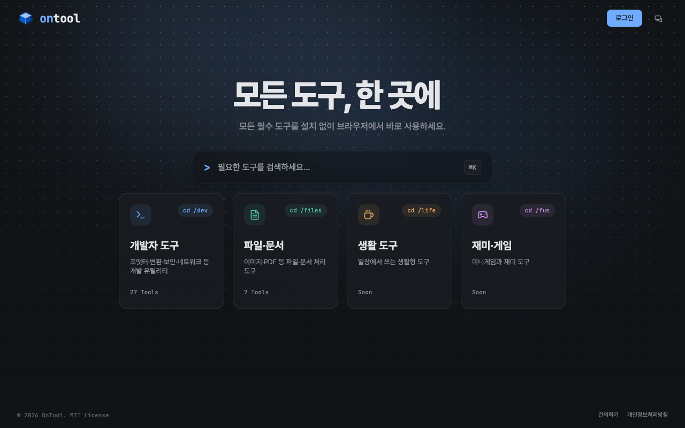

# OnTool

**OnTool(온툴) — 모든 도구, 한 곳에.**  
개발자 도구 · 파일·문서 · 생활 도구 · 재미·게임 4개 구역으로 구성된 종합 도구 포털이다. 공통 인터페이스 하나로 각 구역의 도구를 관리하며, 새 도구는 클래스 하나만 추가하면 자동 등록된다.

> 백엔드 데브코스 10기 12회차 — 데브코스 프로덕트 챌린지 프로젝트

> **v2 개편 진행 중 (2026-07)**: 개발자 도구를 넘어 파일·문서 / 생활 도구 / 재미·게임까지 아우르는 **종합 도구 포털**로 전환하고 있다. 랜딩 대문(`/`)과 4구역(`/dev` 개발자 도구 · `/files` 파일·문서 · `/life` 생활 도구 · `/fun` 재미·게임) 구조, Flyway 기반 스키마 관리는 구현이 완료됐다. 소셜 로그인(구글·카카오, JWT) 및 마이페이지 기능이 구현 중이다.


*(v2 랜딩 페이지 스크린샷으로 업데이트 예정. 사용자님, 새로운 랜딩 페이지 스크린샷을 찍어 `docs/preview.png`에 덮어씌워 주세요!)*

---

## 동작 방식

도구는 두 종류로 나뉜다.

- **Heavy** — 이미지→PDF, PDF 병합, 마크다운→PDF 같은 파일 처리형 도구. 파일을 업로드하면 처리가 끝날 때까지 시간이 걸리므로, 요청은 즉시 작업 ID만 돌려받고 완료되면 알림(SSE)으로 통보받아 결과를 다운로드한다.
- **Light** — JSON 포맷터, Base64 인코딩처럼 텍스트를 입력하면 그 자리에서 바로 결과가 나오는 도구. 업로드나 대기 없이 버튼을 누르는 즉시 결과가 뜬다.

PDF 변환처럼 수 초가 걸리는 작업과 JSON 포맷터처럼 즉석에서 끝나는 작업이 같은 인터페이스 아래 공존한다. 이를 가능하게 하는 건 `ToolModule` 인터페이스다.

```java
public interface ToolModule {
    String getId();
    String getName();
    String getCategory();
    boolean isHeavy();      // 처리 경로를 결정하는 유일한 분기점
    ToolResult process(ToolInput input) throws ToolProcessingException;
}
```

새 도구는 이 인터페이스를 구현하는 `@Component` 클래스 하나만 추가하면 된다. Spring이 자동으로 감지해 등록하고, `isHeavy()` 값에 따라 처리 경로가 결정된다.

```
isHeavy() = true  → Job DB 등록 → 작업 ID 즉시 반환
                    ↓ 워커 백그라운드 처리
                    클라이언트: 폴링 or SSE로 완료 감지 → 결과 다운로드

isHeavy() = false → 즉시 처리 → 바로 응답
```

---

## 제공 도구 (8개 카테고리, 34개)

### PDF (4, Heavy)
- **이미지 → PDF** — 이미지를 하나의 PDF로 묶기
- **마크다운 → PDF** — Markdown 문서를 PDF로 변환
- **PDF 병합** — 여러 PDF를 하나로 병합
- **PDF 분할** — PDF를 페이지 단위로 분할

### 이미지 (3, Heavy)
- **이미지 리사이즈** — 이미지 크기 및 해상도 조정 (업스케일 시 품질 저하 경고 포함)
- **이미지 포맷 변환** — PNG, JPG, WebP 등 포맷 변환
- **GIF 생성** — 이미지 시퀀스를 GIF로 변환

### 생성기 (4, Heavy/Light)
- **JSON Schema → DTO** — JSON Schema로 Java DTO 클래스 생성 (Heavy)
- **OpenAPI → 코드 생성** — OpenAPI 스펙으로 클라이언트 코드 생성 (Heavy)
- **UUID 생성기** — UUID v4 무작위 생성 (Light)
- **코드 생성기** — QR·바코드 생성 (Light)

### 보안·암호화 (7, Heavy/Light)
- **Bcrypt 해시** — 비밀번호 Bcrypt 해시 생성 및 검증
- **RSA/EC 키쌍 생성** — RSA 공개키/개인키 쌍 생성
- **의존성 취약점 스캔** — 의존성 파일(Gradle/Maven) CVE 취약점 검사 (Heavy)
- **AES 암호화/복호화** — AES-256 CBC 암호화/복호화
- **HMAC 서명** — HMAC-SHA256/SHA512 서명 생성
- **다중 해시** — MD5·SHA-1·SHA-256·SHA-512 동시 생성
- **TOTP 생성** — TOTP 일회용 코드 생성 (RFC 6238)

### 포맷터 (8, Light)
- **SQL 포맷터** — SQL 쿼리 정렬 및 포맷
- **XML 포맷터** — XML 문서 들여쓰기 정렬
- **JSON 포맷터** — JSON 정렬 및 미니파이
- **JWT 디코더** — JWT 토큰 Header·Payload 파싱
- **타임스탬프** — Unix timestamp ↔ 날짜/시간 변환
- **색상 코드** — HEX ↔ RGB ↔ HSL 변환
- **인코더/디코더** — Base64·URL·HTML Entity 인코딩/디코딩
- **데이터 포맷 변환** — JSON·YAML·TOML·XML·CSV 상호 변환

### 텍스트 (3, Light)
- **Diff 비교** — 두 텍스트 차이 시각화
- **Regex 테스터** — 정규표현식 실시간 테스트
- **텍스트 유틸** — 케이스 변환·글자 수·한영 변환·공백 정규화

### 네트워크 (3, Light)
- **HTML 소스 가져오기** — URL에서 HTML 소스 가져오기
- **서브넷 계산기** — IP 서브넷 마스크 계산
- **URL 파서** — URL 구성 요소 분해 및 파싱

### DevOps (2, Light)
- **Cron 표현식 파서** — Cron 표현식 파싱 및 다음 실행 시각
- **docker run → Compose 변환** — docker run 명령어 → docker-compose.yml 변환

---

## 서비스 기능

**소셜 로그인 (구글 · 카카오)**  
익명 기본 + 로그인은 부가 가치인 구조다 — 로그인 없이도 모든 도구를 지금처럼 쓸 수 있고, 로그인은 닉네임 표시·개인화 동기화 같은 혜택만 얹는다.

- **로그인 시작**: 프론트가 `GET /oauth2/authorization/{google|kakao}`로 브라우저를 통째로 이동시킨다(fetch/axios 아님 — OAuth 인가 코드 흐름은 top-level navigation이 필요). Spring Security OAuth2 Client가 구글은 OIDC 프리셋으로, 카카오는 커스텀 provider(`authorization-uri`/`token-uri`/`user-info-uri`를 직접 등록)로 처리한다.
- **로그인 성공 처리**: `OAuth2LoginSuccessHandler`가 구글(`sub`/`email`/`name`)과 카카오(`id`, 중첩된 `kakao_account.email`/`kakao_account.profile.nickname`)의 서로 다른 속성 구조를 통일된 `OAuth2UserAttributes`로 매핑하고, `(provider, providerId)` 기준으로 `User`를 upsert한다. **첫 로그인일 때만** 소셜 프로필명을 닉네임 기본값으로 쓰고(20자 초과 시 절단), 이미 있는 유저면 기존 닉네임을 그대로 둔다 — 재로그인마다 소셜 프로필명으로 덮어쓰지 않는다. 카카오는 이메일 동의항목을 안 쓰므로 `email`이 항상 `null`이며 스키마도 이를 반영해 nullable이다.
- **토큰 발급 및 콜백**: 성공 즉시 JWT access(30분)와 opaque 랜덤 refresh(14일, DB에 SHA-256 해시로만 저장)를 발급해 `{FRONTEND_URL}/auth/callback#access=…&refresh=…`로 리다이렉트한다. 서버 로그·Referer에 남지 않도록 쿼리스트링이 아니라 URL fragment를 쓴다. 실패 시(동의 거부 등)는 `#error=login_failed`.
- **토큰 저장 위치는 쿠키가 아니라 프론트 localStorage다**(ADR-0024). 프론트(Vercel)와 백엔드(다른 도메인)가 루트 도메인이 달라 크로스사이트 쿠키가 필요한데, 서드파티 쿠키 차단이 갈수록 강해져 안정적이지 않다고 판단했다. 대신 XSS로 탈취될 위험을 안고 가는 대신, access를 30분으로 짧게 두고 refresh 회전+탈취 감지로 피해 범위를 줄인다 — 결제 정보 없는 개발 도구 사이트 특성상 감내 가능한 트레이드오프로 판단. 로그인 핸드셰이크 동안만 쓰이는 `JSESSIONID` 세션 쿠키(Spring Security 기본 동작)가 하나 있지만 API 인증과는 무관하다.
- **Refresh 회전 + 멀티탭 유예**: `/api/v1/auth/refresh`는 매 호출마다 refresh를 새 값으로 교체(rotation)한다. 탭 두 개가 동시에 재발급을 시도하면 하나는 "이미 회전된 토큰"을 보게 되는데, 이를 즉시 탈취로 간주해 로그아웃시키는 대신 직전 회전 후 30초 유예를 두어 그 안의 재사용은 방금 발급된 최신 토큰쌍을 그대로 돌려준다. 유예를 넘겨서 재사용되면 그때는 진짜 탈취로 보고 해당 유저의 refresh 토큰을 전부 폐기한다.
- **로그아웃**: `POST /api/v1/auth/logout`(Authorization 필수)은 지정한 refresh 토큰을 삭제할 뿐 아니라, 요청에 쓰인 access 토큰 자체도 해시로 블랙리스트(`revoked_access_token`)에 올려 자연 만료(최대 30분) 전이라도 그 즉시 무효화한다 — JWT는 원래 상태 없이(stateless) 서명·만료만 검증하므로, 이 블랙리스트 조회가 없으면 로그아웃한 토큰이 남은 수명 동안 계속 인증에 성공해버린다.
- **인증 필터**: `JwtAuthenticationFilter`는 `Authorization: Bearer` 헤더가 없거나 유효하지 않아도 요청을 그냥 통과시킨다(익명 기본 원칙) — `/api/v1/users/me`, `/api/v1/auth/logout`처럼 로그인이 실제로 필요한 엔드포인트만 `SecurityConfig`에서 별도로 `authenticated()`를 걸어 401을 강제한다. `X-Client-Id`(익명 쿼터 식별자)는 로그인 여부와 무관하게 그대로 병행 전송된다.
- **내 정보**: `GET`/`PATCH /api/v1/users/me` — 닉네임은 트림 후 2~20자만 허용.

**댓글**  
각 도구 페이지에 익명으로 피드백을 남길 수 있다. 로그인 불필요. 관리자는 `/admin/comments/{id}`로 삭제 가능.

**사용 통계 · 좋아요**  
도구별 사용 횟수와 좋아요 수를 집계한다. 좋아요는 localStorage로 중복 방지. 통계는 `GET /api/v1/tools/{moduleId}/stats`로 조회.

**건의사항**  
새 도구 요청이나 개선 의견을 남길 수 있다. 관리자 페이지에서 목록 조회 가능.

**관리자 페이지**  
`/admin/stats` — 전체 통계 조회. `/admin/suggestions` — 건의사항 목록. HTTP Basic Auth 보호.

---

## Heavy 처리 구조

외부 인프라(Redis, RabbitMQ 등) 없이 MySQL만으로 분산 큐를 구현했다.

- **DB 기반 큐**: `Job` 테이블의 `PENDING` 상태가 큐 역할. `SELECT FOR UPDATE SKIP LOCKED`로 다중 워커가 동일 Job을 중복 처리하지 않도록 보장
- **비동기 워커**: `@Scheduled` + `@Async` + `ThreadPoolTaskExecutor`. PENDING Job을 꺼내 `process()` 호출
- **결과 분기**: 파일 결과 → `FileStorage` 인터페이스로 저장 (개발·운영 모두 로컬 디스크, 운영은 Docker 볼륨). 텍스트 결과 → Job 레코드에 직접 저장
- **SSE 알림**: `SseEmitter`로 Job 상태 변경을 클라이언트에 실시간 푸시
- **배치**: 파일 N개 → Job N개 생성. `batch_id`로 묶어 진행률 집계

---

## DB 스키마

Heavy 도구의 처리 단위인 `Job` 테이블이 큐의 핵심이다.

| 컬럼            | 타입           | 설명                                               |
|---------------|--------------|--------------------------------------------------|
| `id`          | VARCHAR(36)  | 작업 ID (UUID)                                     |
| `module_id`   | VARCHAR(50)  | 도구 식별자 (예: `"image-to-pdf"`)                     |
| `batch_id`    | VARCHAR(36)  | 배치 그룹 키. 단건이면 null                               |
| `status`      | VARCHAR(10)  | `PENDING` → `RUNNING` → `DONE` / `FAILED`        |
| `input_paths` | JSON         | 입력 파일 경로 배열. 순서 보존                               |
| `params`      | JSON         | 모듈 옵션. 예: `{"width":"800","height":"600"}`       |
| `result_key`  | VARCHAR(255) | 파일 결과 식별자. `FileStorage.getUrl(key)`로 URL 생성     |
| `result_text` | TEXT         | 텍스트 결과 (해시값, CVE 목록 등). `result_key`와 둘 중 하나만 사용 |
| `created_at`  | DATETIME     | 생성 시각                                            |
| `expires_at`  | DATETIME     | TTL 만료 시각. 만료 시 파일 자동 삭제                         |

소셜 로그인(구글·카카오) 관련 테이블 3개:

| 테이블                  | 핵심 컬럼                                                  | 설명                                                    |
|------------------------|-------------------------------------------------------|---------------------------------------------------------|
| `app_user`             | `provider`, `provider_id`, `email`(nullable), `nickname` | `UNIQUE(provider, provider_id)`. 테이블명이 `user`가 아닌 이유는 MySQL 예약어라서 |
| `refresh_token`        | `token_hash`, `rotated_at`, `grace_token`, `expires_at`  | refresh는 원문이 아니라 SHA-256 해시로만 저장. `rotated_at`/`grace_token`으로 회전 + 30초 유예를 구현 |
| `revoked_access_token` | `token_hash`(PK), `expires_at`                          | 로그아웃된 access 토큰 블랙리스트. 자연 만료 전까지 즉시 무효화하기 위함           |

---

## 기술 스택

| 영역       | 기술                                                                           |
|----------|------------------------------------------------------------------------------|
| 백엔드      | Spring Boot 4.1.0, JDK 25, Gradle Kotlin DSL, Spring Security                |
| 데이터      | MySQL 8, JPA                                                                 |
| 주요 라이브러리 | PDFBox, Thumbnailator, flexmark+openhtmltopdf, ZXing, Bouncy Castle, Jackson |
| 테스트      | JUnit 5, Testcontainers, Awaitility                                          |
| 프론트엔드    | Vue 3, Vite                                                                  |
| 인프라      | Docker Compose, Oracle Cloud Always Free, Vercel, nginx (리버스 프록시 + TLS)      |
| API 문서   | Swagger UI (springdoc-openapi)                                               |

---

## 프로젝트 구조

```
OnTool/
├── back/                        # Spring Boot 백엔드
│   └── src/main/java/com/back/
│       ├── global/
│       │   ├── config/          # AsyncConfig, SecurityConfig, WebMvcConfig
│       │   ├── exception/       # AppException, ErrorCode, GlobalExceptionHandler
│       │   ├── ratelimit/        # RateLimiter, ClientIpResolver — IP 기반 rate limiting
│       │   ├── response/        # ErrorResponse
│       │   ├── storage/         # FileStorage 인터페이스, LocalFileStorage, OrphanFileSweeper
│       │   └── util/            # 공통 유틸
│       ├── tool/                # 도구 플랫폼(model·service·controller·dto) + 카테고리별 구현체 23개
│       │   ├── pdf/  image/  codegen/  security/  util/
│       │   └── generator/  formatter/  converter/  network/  devops/
│       ├── job/                 # Job 엔티티·Worker·스케줄러·배치 (entity·repository·service·controller·dto)
│       ├── comment/
│       ├── stats/
│       ├── suggestion/
│       └── admin/
├── front/                       # Vue 3 프론트엔드
└── docker-compose.yml           # MySQL 로컬 환경
```

---

## 로컬 실행

**요구사항:** JDK 25, Docker

```bash
# MySQL 실행
docker compose up -d

# 백엔드
cd back
./gradlew bootRun --args='--spring.profiles.active=local'

# 프론트엔드
cd front
pnpm install && pnpm dev
```

| 서비스    | URL                                     |
|--------|-----------------------------------------|
| 백엔드    | `http://localhost:8080`                 |
| 프론트엔드  | `http://localhost:5173`                 |
| API 문서 | `http://localhost:8080/swagger-ui.html` |

---

## 환경변수

**로컬 (`application-local.yaml`):**  
MySQL은 `docker compose up -d`로 실행. 관리자 계정은 yml에 직접 작성한다.

```yaml
spring:
  security:
    user:
      name: admin
      password: 1234
```

소셜 로그인을 로컬에서 실제로 테스트하려면 `back/.env.example`을 `back/.env`로 복사해 구글·카카오 자격증명을 채운다.
`back/.env`는 `.gitignore` 대상이라 커밋되지 않으며, `./gradlew bootRun`이 자동으로 읽어 환경변수로 주입한다(파일이 없으면
그냥 무시하고 기동 — `application.yaml`의 더미 client-id/secret 기본값 덕분에 소셜 로그인 없이도 앱은 정상 동작한다).

```bash
cd back
cp .env.example .env
# .env를 열어 GOOGLE_CLIENT_ID 등 4개 값을 채운다
./gradlew bootRun --args='--spring.profiles.active=local'
```

**운영 (`application-prod.yaml`):**  
비밀번호를 코드에 하드코딩하지 않고 환경변수로 주입한다. 배포는 `.github/workflows/deploy.yml`이
아래 **GitHub Secrets**를 읽어 OCI VM에 `.env`를 생성하고 `docker-compose.prod.yml`을 띄운다.
(운영 `.env`는 배포 파이프라인이 그때그때 생성하는 것이라 리포지토리에는 두지 않는다 — 로컬 전용
`back/.env.example`과는 별개다.)

리포지토리 Settings → Secrets and variables → Actions 에 등록:

| Secret                 | 설명                                                   |
|------------------------|------------------------------------------------------|
| `OCI_HOST`             | 배포 대상 VM 호스트/IP                                      |
| `OCI_SSH_KEY`          | VM 접속용 SSH 개인키                                       |
| `GHCR_TOKEN`           | GHCR 이미지 pull용 토큰                                    |
| `DB_USERNAME`          | MySQL 사용자명                                           |
| `DB_PASSWORD`          | MySQL 사용자 비밀번호                                       |
| `DB_ROOT_PASSWORD`     | MySQL root 비밀번호                                      |
| `ADMIN_USERNAME`       | 관리자 HTTP Basic Auth 사용자명                             |
| `ADMIN_PASSWORD`       | 관리자 HTTP Basic Auth 비밀번호                             |
| `CORS_ORIGIN`          | 허용할 프론트엔드 도메인 (Vercel URL)                           |
| `STORAGE_BASE_URL`     | 파일 다운로드 링크 생성용 백엔드 공개 URL                            |
| `GOOGLE_CLIENT_ID`     | 구글 OAuth 웹 클라이언트 ID                                 |
| `GOOGLE_CLIENT_SECRET` | 구글 OAuth 웹 클라이언트 보안 비밀                               |
| `KAKAO_CLIENT_ID`      | 카카오 OAuth 앱 REST API 키                               |
| `KAKAO_CLIENT_SECRET`  | 카카오 OAuth 앱 Client Secret                            |
| `JWT_SECRET`           | JWT 서명용 무작위 암호화 키                                   |
| `FRONTEND_URL`         | 로그인 완료 후 리다이렉트할 프론트엔드 주소 (Vercel 도메인)               |

> **⚠️ 소셜 로그인 (OAuth2) 설정 가이드**  
> 백엔드 인증 연동을 위해 구글 클라우드 콘솔 및 카카오 디벨로퍼스에서 앱을 생성하고, **반드시 아래의 승인된 리디렉션 URI를 콘솔에 등록**해야 합니다.
> - **구글 (Google)**
>   - 로컬: `http://localhost:8080/login/oauth2/code/google`
>   - 운영: `https://140-245-69-204.sslip.io/login/oauth2/code/google`
> - **카카오 (Kakao)**
>   - 로컬: `http://localhost:8080/login/oauth2/code/kakao`
>   - 운영: `https://140-245-69-204.sslip.io/login/oauth2/code/kakao`

**프론트엔드 (Vercel → Settings → Environment Variables):**

| 변수                  | 설명                                                             |
|---------------------|----------------------------------------------------------------|
| `VITE_API_BASE_URL` | 백엔드 API 공개 URL                                                 |
| `VITE_GA_ID`        | GA4 측정 ID (`G-XXXX`). Production만 설정 — 미설정 빌드는 gtag 요청 자체가 없음   |
| `VITE_SITE_URL`     | sitemap.xml/robots.txt에 쓸 사이트 공개 URL. 미설정 시 임시 플레이스홀더로 생성       |

---

## License

This project is licensed under the [MIT License](LICENSE) - see the LICENSE file for details.
